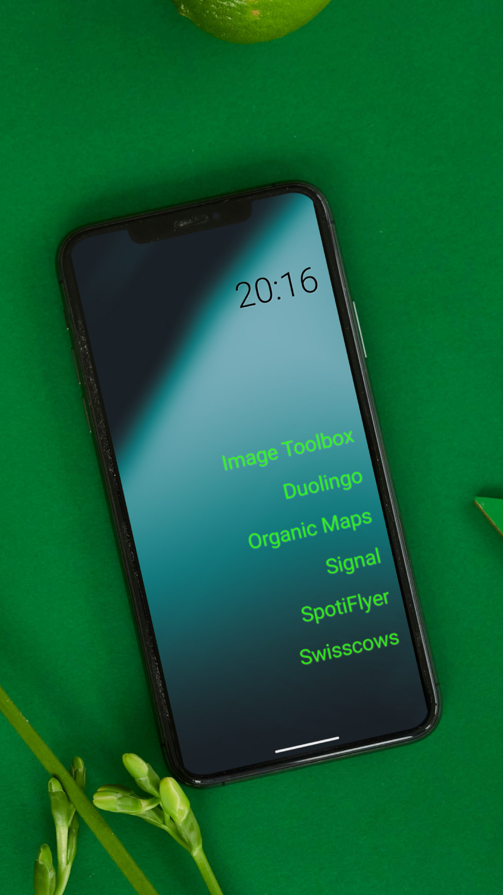
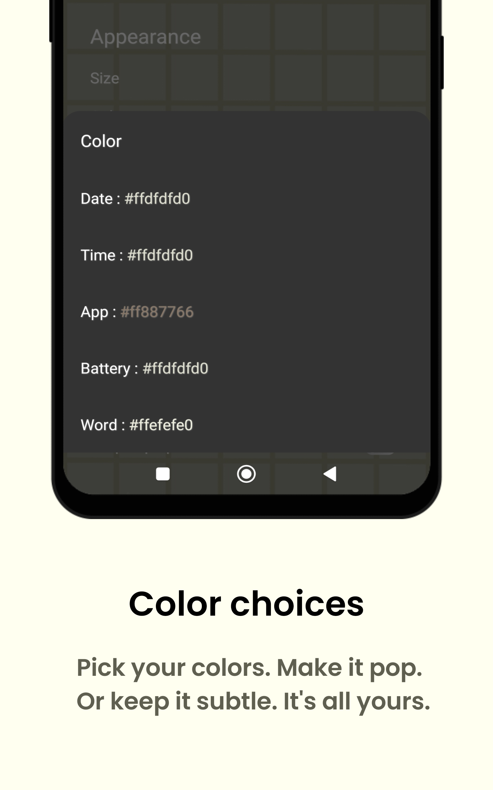
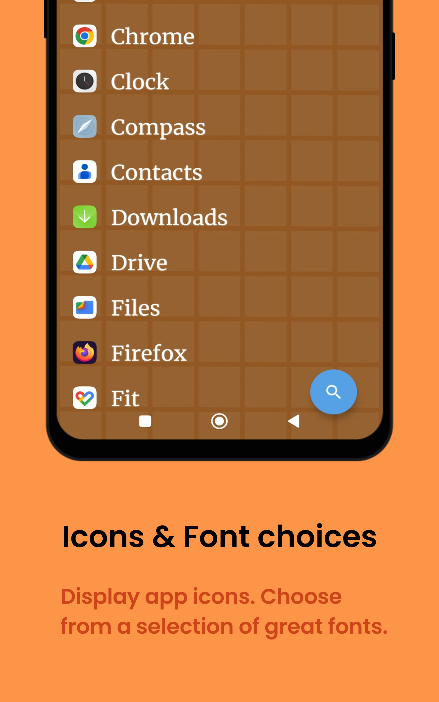

	<h2>EasyLauncher - Minimal and Clutter Free Android launcher</h2>
    <table align='center'>
        Click on any image to enlarge it. To know more, explore and see for yourself.
        <tr>
            <td></td>
            <td></td>
            <td></td>
        </tr>
	    <tr>
            <td></td>
            <td></td>
            <td></td>
        </tr>
        <tr>
            <td></td>
            <td></td>
            <td></td>
	    </tr>
    </table>
    

        
        
    

    

        
        
        
         
        
        
         
        
        
         
        
    

## About

#### Easy Launcher - the minimalist productivity launcher for focus, productivity, keep your focus on what really counts.

- Chat with us at [EasyLauncher](https://t.me/DroidWorksStudio) on telegram.
- This application can be found on [F-Droid](https://f-droid.org/packages/app.easy.launcher/) and [Github](https://github.com/HeCodes2Much/EasyLauncher/releases/).
- The latest stable version is available on the [`main`](https://github.com/HeCodes2Much/EasyLauncher/tree/main) branch, which can be cloned to build the application independently.
- Additionally, a Github action has been set up to automatically generate an APK for every [release](https://github.com/HeCodes2Much/EasyLauncher/releases).

We try to balance customizability and minimalization well still being simple :)</h3>

## Features:

- Favorite App Quick Access: Display your most-used apps on the home screen in text format for swift access, streamlining your operations.
- Hide Apps: Easily conceal apps you don't want visible, keeping your home screen clean and focused on essential content.
- Rename Apps: Personalize your apps with custom names that sync seamlessly between favorites and all apps.
- Locking: Secure your privacy and data with fingerprint lock for selected apps and settings.
- No Internet Permissions: No use of INTERNET permissions, ensuring your data remains private.
- Crash Reports: Report crashes via email, including log files for effective troubleshooting.

#### Personalized Customization:

- Font Colors: Customize font colors using our color picker.
- Position: Align Date, Time, and Apps to Left, Center, or Right.
- Padding: Adjust padding between favorite apps and all apps.
- Font Size: Set font size for each element on the home screen.
- Toggle Items: Control display preferences on the home screen.

#### Possible Gestures Include:

- Swiping Gestures: Navigate by swiping in different directions (up, down, left, right) to access various features or move between screens.
- Double Tap: Quickly tap the screen twice to perform a predefined action or activate a feature.
- Clock Interaction: Tap on the clock to display additional information such as alarms or world clock.
- Date Interaction: Tap on the date to open the calendar app for scheduling and planning.
- Battery Icon: Tap on the battery icon to access battery usage details.

#### Possible Actions Include:

- Open Specified App: Instantly launch any app you choose for seamless access to your favorites.
- Display App List: View and manage your installed apps efficiently with a comprehensive list display.
- Screen Locking: Secure your device and protect your privacy with quick and convenient screen locking.
- Show Recently Opened Apps: Access recently used apps effortlessly for swift multitasking.
- Notification Drawer Access: Open the notification drawer with a single tap to check updates and alerts.
- Quick Settings: Manage device settings swiftly by accessing quick settings directly from the home screen.
- Power Dialog: Control power options such as restart, power off, and more with ease using the power dialog.
- Take a Screenshot: Capture your screen instantly to save and share important information and moments.
- Disable Gestures: Temporarily or permanently disable specific gestures to customize your device interaction experience.

## Contribute

- If you are unhappy with any part of the app or feel like missing something, you can open a pull request or an [**issue
  **](https://github.com/HeCodes2Much/EasyLauncher/issues/new/choose) as you like.
    - Please go through the issues marked as `Bug report`, `Crash report` or `Feature request`.
    - Please can we discuss before sending pull requests.
    - Make pull requests to `main` branch.
- Any help in translating EasyLauncher into other languages is greatly appreciated. [**Crowdin**](https://crowdin.com/project/easy-launcher).

## Credits

- This project is partially based on code from [neophtex/AsterLauncher](https://github.com/neophtex/AsterLauncher), though it has been significantly modified.

Sure, here is a revised and improved version of the license description:

---

## License

**EasyLauncher is proudly licensed under the DWS Source First License 1.0, which provides users with the rights to use, study, modify, and distribute the software under the conditions specified below.**

- **Non-Commercial Use**: EasyLauncher may be used or modified for non-commercial purposes only, such as personal use, research, experimentation, testing, personal study, private entertainment, hobby projects, amateur pursuits, or religious observance.

- **Distribution**: You may distribute EasyLauncher or provide it to others free of charge, as long as it remains for non-commercial purposes.

- **Integrity of Notices**: You must retain any licensing, copyright, or other notices of the Licensor in the software. Additionally, you cannot remove or obscure any functionality related to payment to the Licensor in distributed copies.

- **Modifications**: If you modify EasyLauncher, you must include a prominent notice in any modified copies stating that you have modified the software. This can be a statement in a readme file or an in-application about section.

- **No Network Access**: EasyLauncher does not have network access.

- **No Data Collection**: EasyLauncher does not collect or transmit any data in any way whatsoever.

The **Copyleft** provision ensures that these freedoms are preserved, guaranteeing that EasyLauncher remains a fully open-source project. With access to the full source code, anyone can build, fork, and customize the application to unlock its full potential.

For further details, refer to the full text of the [DWS Source First License 1.0](LICENSE) included with this software.

## Permissions

EasyLauncher uses the following permissions:

- `android.permission.EXPAND_STATUS_BAR`
    - Allows an application to expand or collapse the status bar.
- `android.permission.QUERY_ALL_PACKAGES`
    - Allows query of any normal app on the device, regardless of manifest declarations. Used to show the apps list.
- `android.alarm.permission.SET_ALARM`
    - Allows an application to broadcast an Intent to set an alarm for the user. Used to open the default alarm app if no other clock app is set in the settings.
- `android.permission.REQUEST_DELETE_PACKAGES`
    - Required for issuing the request to remove packages. This does not allow the app to remove apps directly; this only gives the permission to issue the request.
- `android.permission.PACKAGE_USAGE_STATS`
    - Allows EasyLauncher to see usage of other apps to list last used apps first in the app list.

## Donation

We kindly request that you consider supporting the ongoing development of EasyLauncher by making a donation if you find it to be a useful application. As a free and open-source
product, EasyLauncher depends entirely on the support and generosity of its users to maintain its continued growth and accessibility to all. Please note that while purchasing is
not obligatory, even a small donation would go a long way in helping us to keep EasyLauncher alive and thriving. We appreciate your continued support, and thank you for your
contribution towards the betterment of our product. 😊

