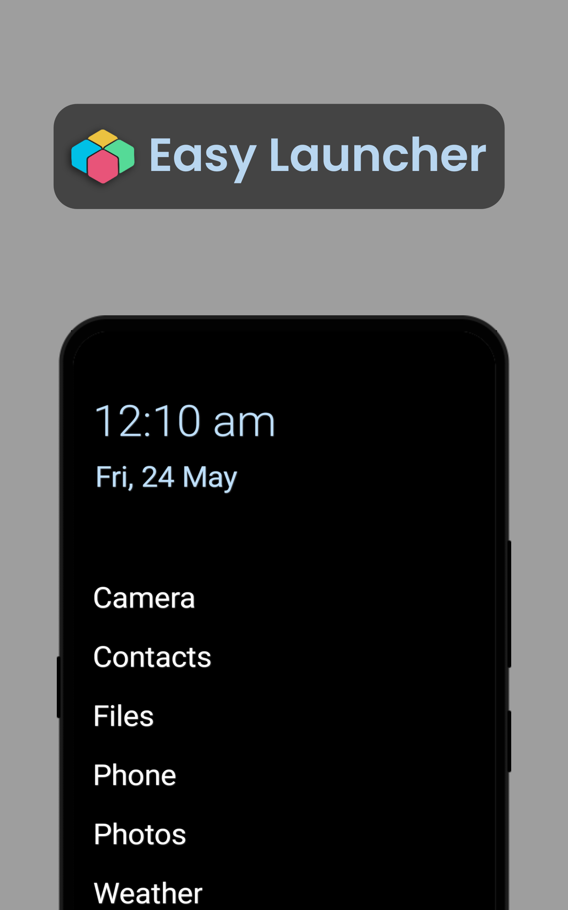
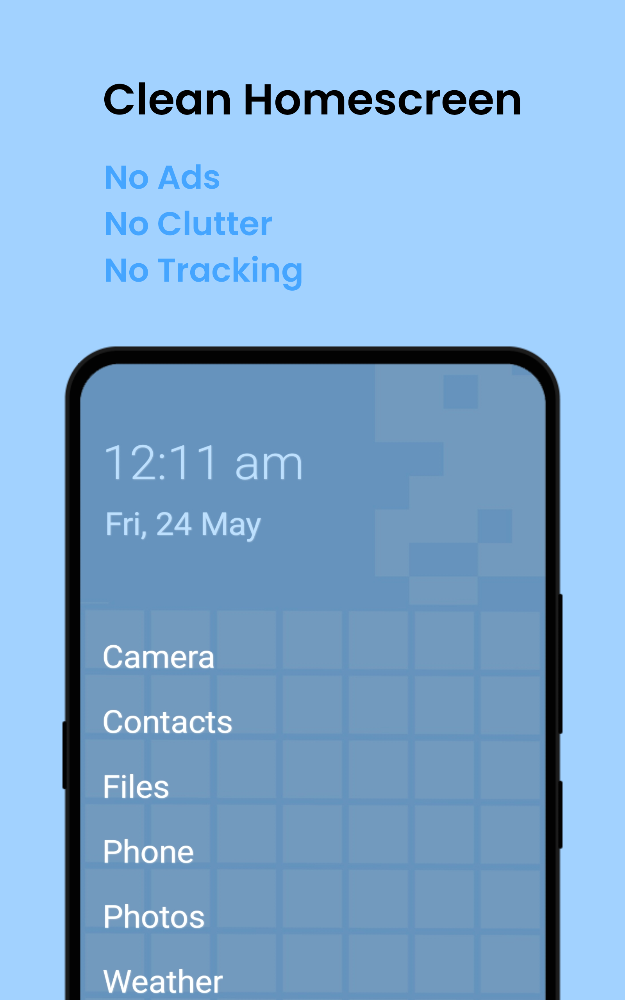
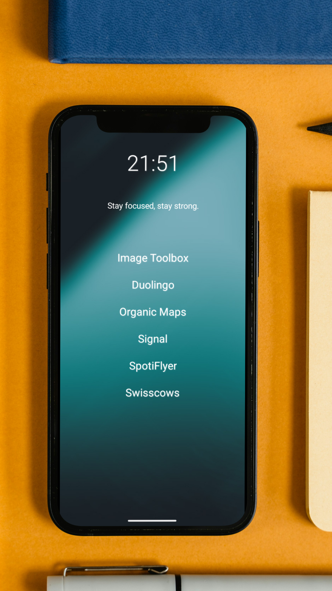
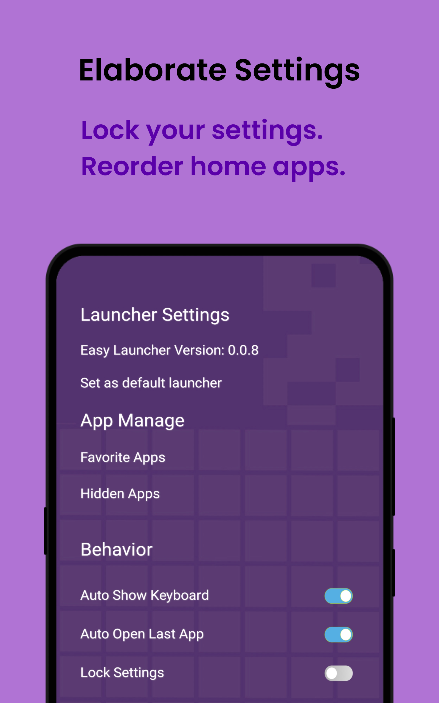
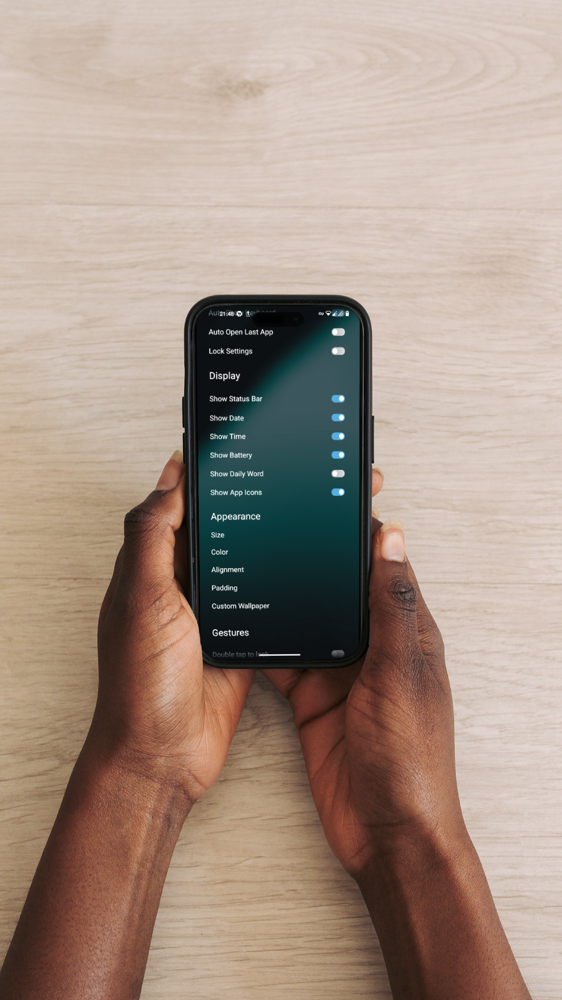
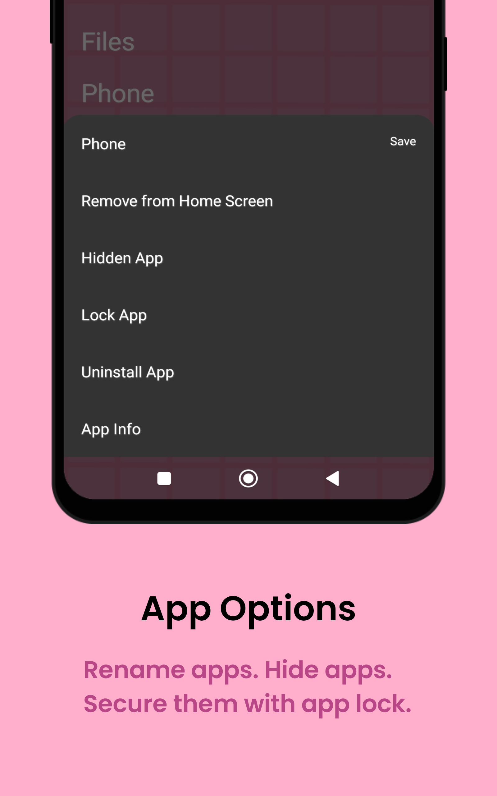

	<h2>EasyLauncher - Minimal and Clutter Free Android launcher</h2>
    <table align='center'>
        Click on any image to enlarge it. To know more, explore and see for yourself.
        <tr>
            <td></td>
            <td></td>
            <td></td>
            <td></td>
            <td></td>
            <td></td>
        </tr>
    </table>
    

        
        
    

------------
**About**
------------
**Easy Launcher - the minimalist productivity launcher for focus, productivity, keep your focus on what really counts.**
------------

      
**Features**
------------
- **Favorite App Quick Access: Display your favorite apps in text format on the home screen for swift access to your most-used apps, streamlining your operations.**

- **Hide Apps: Easily conceal apps that you don't want to be visible, keeping your home screen clean and focused on the content you need.**

- **App Locking: Secure your privacy and data by fingerprint to lock selected apps.**

- **Personalized Customization: Choose the font color and position for time, date, and favorite apps, making your home screen truly reflect your style.**
